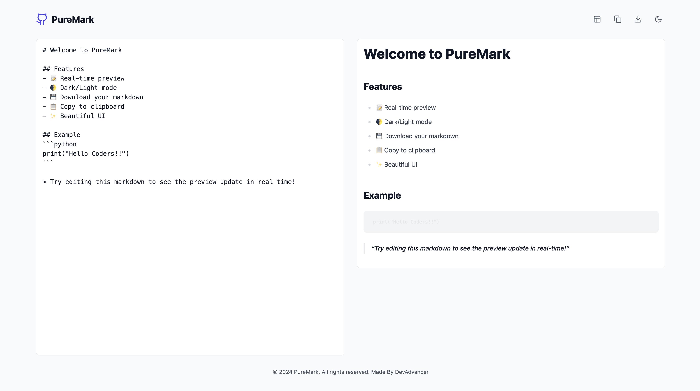
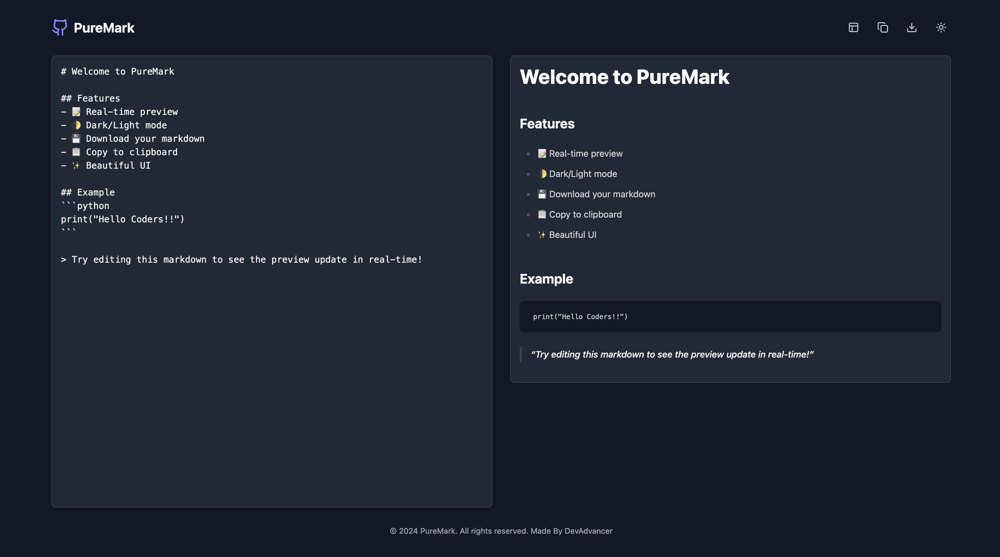

# PureMark - Markdown Editor

PureMark is a lightweight, feature-rich markdown editor that offers real-time preview and multiple customization options. The application is built with React and uses modern libraries for enhanced functionality and a sleek user interface.

## Features
- 📝 **Real-time Preview**: See your changes as you type.
- 🌓 **Dark/Light Mode**: Toggle between themes based on your preference.
- 💾 **Download Markdown**: Save your markdown content as a `.md` file.
- 📋 **Copy to Clipboard**: Quickly copy the markdown content with one click.
- ✨ **Beautiful UI**: User-friendly and responsive design for an exceptional experience.

---

## Getting Started

### Prerequisites
To run this project locally, ensure you have the following installed:
- Node.js (v14 or higher)
- npm or yarn package manager

### Installation
1. Clone this repository:
   ```bash
   git clone https://github.com/<your-username>/PureMark.git
   cd PureMark
   ```

2. Install dependencies:
   ```bash
   npm install
   # or
   yarn install
   ```

3. Start the development server:
   ```bash
   npm start
   # or
   yarn start
   ```

4. Open the app in your browser:
   ```
   http://localhost:3000
   ```

---

## Project Structure
```plaintext
PureMark/
├── public/
│   ├── index.html
│   └── favicon.ico
├── src/
│   ├── components/
│   ├── App.js
│   ├── index.js
│   ├── styles/
│   └── assets/
├── package.json
└── README.md
```

---

## Libraries Used
- **React**: For building the user interface.
- **React Markdown**: For rendering markdown content.
- **remark-gfm**: To enable GitHub Flavored Markdown (GFM).
- **Lucide Icons**: For elegant and lightweight icons.
- **Tailwind CSS**: For styling and responsiveness.

---

## Usage

### Writing Markdown
Type your markdown in the editor on the left. The real-time preview is displayed on the right.

### Key Features
- **Theme Toggle**: Click the sun/moon icon to switch between light and dark modes.
- **Copy Markdown**: Click the clipboard icon to copy your markdown content to the clipboard.
- **Download Markdown**: Click the download icon to save your content as a `.md` file.
- **Toggle Preview**: Use the layout icon to hide/show the preview pane.

---

## Screenshots

### Light Mode


### Dark Mode


---

## Future Enhancements
- Add support for exporting to PDF.
- Provide syntax highlighting in the editor.
- Allow custom themes for more personalization.

---

## Contribution
Contributions are welcome! Follow these steps to contribute:
1. Fork the repository.
2. Create a new branch:
   ```bash
   git checkout -b feature-name
   ```
3. Commit your changes:
   ```bash
   git commit -m "Add a new feature"
   ```
4. Push to your branch:
   ```bash
   git push origin feature-name
   ```
5. Open a pull request.

---

## License
This project is licensed under the [MIT License](LICENSE).

---

## Author
**DevAdvancer**

- GitHub: [@DevAdvancer](https://github.com/DevAdvancer)
- LinkedIn: [@Abhirup Kumar](https://www.linkedin.com/in/abhirupkumar)
